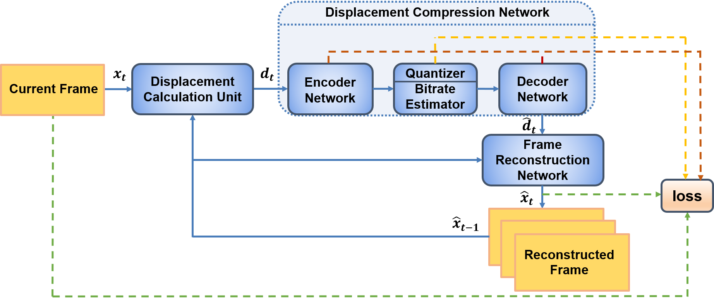
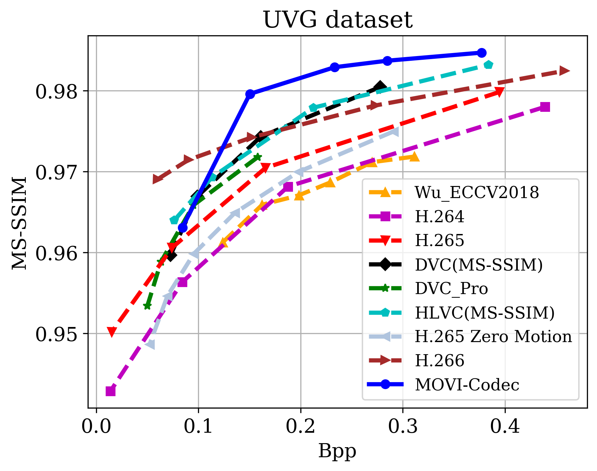

# Learning to compress videos without computing motion

This repo holds the code for the paper:

Chen, M., Goodall, T., Patney, A., & Bovik, A. C. (2022). Learning to compress videos without computing motion. *Signal Processing: Image Communication*, 116633. [[arXiv]](https://arxiv.org/pdf/2009.14110)

## Test

TODO

### Experimental Results

Evaluation results on the UVG dataset and HEVC Class B (1080p) and Class E (720p). Please refer to our paper for more experimental results.

We also provide the data  of our model in file `RDCurve`.

  
   
  

### Citation
If you find our paper useful, please cite:

@article{chen2022learning,
  title={Learning to compress videos without computing motion},
  author={Chen, Meixu and Goodall, Todd and Patney, Anjul and Bovik, Alan C},
  journal={Signal Processing: Image Communication},
  pages={116633},
  year={2022},
  publisher={Elsevier}
}

### Contact
You can contact Meixu Chen by sending mail to chenmx@utexas.edu
